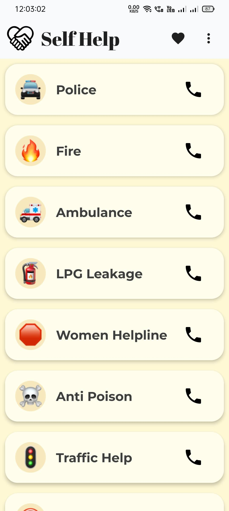
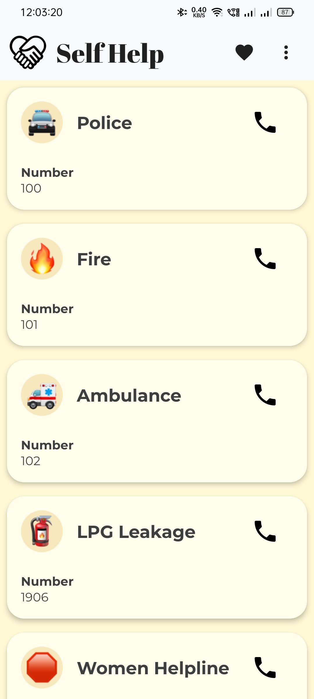

# "Self Help"
Your android app to help you directly call and get emergency help services.

## Table of Contents

- [Self Help](#Self-Help)
- [What is "Self Help"](#What-is-"Self-Help")
- [Basic Features](#Basic-Features)
- [What's Coming Next?](#What's-Coming-Next?)
- [Phase 1](#Phase-1)
- [Phase 2](#Phase-2)
- [Phase 3](#Phase-3)
- [Meet Our Team](#Meet-Our-Team)
- [Licence](LICENCE)
- [Thanksgiving](#Thanks-For-Your-Visit)

## What is "Self Help" ?
We all get in troubles and often we also get into some emergency situations. And fortunately there are different help providers who provides us with different helps in different needs. But not many of us are ready to tackle it with proper procedure.
 
To ease you out from that tensed environment, we just made an android app “Self Help”. It contains all the required emergency contact list of the help providers. And using the app you can directly call and get help instantly in emergency situations.

## Basic Features
* Our app has very simple a user-friendly UI. As we also target the very low-experienced users, we intentionally kept the app very easy to use.

* This app shows different help providers as a card. There are several cards added that are the mostly used help services in India. In each card there is a **_“Call”_** button that directly **_takes you to your dialer app_** with the emergency **_help provider’s number_**.
  
* And in addition to that we also have a feature to watch the number of the help provider. The user can click on any help provider’s name to expand the card and know about the help provider’s number.

## What's Coming Next?
#### [Phase 1](#Phase-1-in-Detail)
1. Build basic app with primary features.

#### [Phase 2](#Phase-2-in-Detail)
1. Add chatbot to the app
1. Make it crowd source

#### [Phase 3](#Phase-3-in-Detail)
1. Connect bigger help providers directly with the users
1. Test and deploy the final app into the market

### Phase 1 in Detail
_1. Basic Layout_

In phase 1 we have just developed a basic level app with very primary feature. And we intentionally made our app very neat and clean to make it user friendly. As this app will be necessary for all level of user.

### Phase 2 in Detail
_1. Adding a Chat-Bot_

In the beginning of phase 2, we would like to add chat-bot into our app. So that the user can send collective to the help-providers. The user will be guided to state their emergency with a few possible options. And at last the funnelled data will be sent to the respective service-providers

_2. Making it Crowd-Source_

In the 2nd part, we want our app to be Crowd-Source. As the user can also add information to our app. Our team will then verify that data. And publish into our app.

### Phase 3 in Detail
_1. Connect help-providers directly to the users_

In the beginning of 3rd phase, we will reach to different help-providers to have access to database with our app. So, that user can get the live information about their help-provider. As an example if we connect with any hospital, the user will be able to check about the bed availability at any given moment.

_2. Test and Deploy_

In the 2nd part, we want our app to be Crowd-Source. As the user can also add information to our app. Our team will then verify that data. And publish into our app.

## Meet Our Team
#### 1. Debosmita Bedajna
* [Github](https://github.com/DebosmitaBedajna)
* [Google Dev Profile](http://g.dev/itsDebosmitaaa)
* [Contact via Mail](mailto:bedajnadebosmita@gmail.com)

#### 2. Santanu Pal
* [Github](https://github.com/code-with-santanu)
* [Google Dev Profile](http://g.dev/santanu03)
* [Contact via Mail](mailto:palsantanu003@gmail.com)

#### 3. Pranti Rani Banda
* [Github](https://github.com/Pranti23)
* [Google Dev Profile](http://g.dev/prantiranibanda)
* [Contact via Mail](mailto:prantibanda@gmail.com)

#### 4. Priyankar Koley
* [Github](https://github.com/priyankarkoley)
* [Google Dev Profile](http://g.dev/priyankarkoley)
* [Contact via Mail](mailto:priyankarkoley@gmail.com)

### Presentations
[PPT Presentation](selfhelp.pptx)

#### Image Preview

<!--  -->

<!--  -->

## Thanks For Your Visit
Thanks for your valuable time. Also thanks [GDSC-TMSL](https://github.com/GDSC-TMSL) for such an opportunity to learn Android using Jetpack Compose.